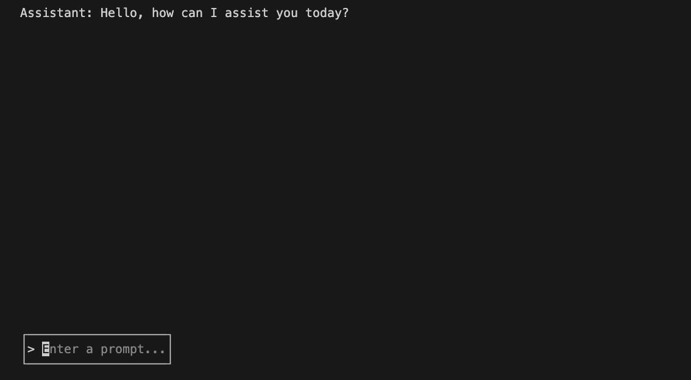

# GoLLM (pronounced "Golem") 

A simple HTTP Server & CLI-based TUI Application that interfaces with the OpenAI API in Golang.

## Set-Up

**Required for Both Modalities**
- Open root directory of project
- Create `.env` file from `.env.template` file, providing OpenAI API Key

### CLI-based TUI Application

- Run command: `go run main.go cli`
- This will initialize the application's TUI and allow you to begin prompting the LLM immediately with response rendered in the TUI (Memory is enabled/Memory Management needs enhancement)
  - **CAUTION**: Context Overflow is possible with the existing `memory` implementation

### Gin-Gonic HTTP Server
- Run command: `go run main.go` or build binary (`go build` and/or `go install`) which will generate an executable named `gollm`
- Using a CLI-based tool like `curl` or a HTTP server testing GUI like Postman, create a new `POST` request to `http://localhost:8080` (default port)
- In the body, create a JSON with a "text" key and assign your prompt as a value (in the form of a string)
- Initiate the request (Press `return` in the CLI or Press "Send" in Postman)
- View the Request's Response Payload for Assistant's Completion for the prompt sent

### Primary Packages Used

- `gin-gonic`: Used to run the HTTP server and route incoming requests. The server only runs when the CLI arg is not passed.
- `bubbletea`: The primary library used to create the TUI. Charmbracelet's TUI toolkit.
- `lipgloss`: Charmbracelet library for stylish TUIs
- `bubbles`: The building blocks to the `bubbletea` library. `bubbles` is to `bubbletea` what a component is to a web application.
- `godotenv`: To access protected variables (like the OpenAI API Key) via a `.env` file
- `go-openai`: A library containing tooling for easy set-up and configuration for OpenAI clients with OpenAI-specific interfaces/types

### Planned Improvements

- "Dockerizing" the application
- Better Log Implementation/Separation
- Compatibility with more LLMs (Claude is next)
- Enhanced Memory
- Retrieval-Augmented Generation Tooling
- Enable Performant Interfacing with ORM Databases (like Postgres) and/or Key-Val stores (like Redis)
- LangChain-like tooling
- Multi-stage and/or recursive/iterative prompting
- Potentially a Web Application to interface with the HTTP server
- Make it possible to host true web server with `nginx` implementation
- AND MORE!

### Contact Me

Email: [cam@fluenze.ai](mailto:cam@fluenze.ai)

Open to other suggestions! Please contact me if you are interested in contributing or open a PR!